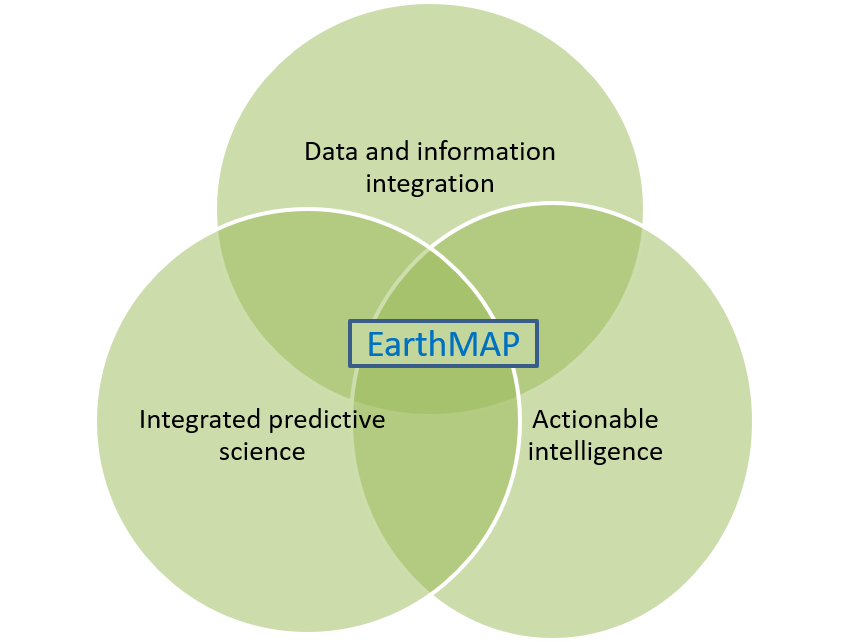
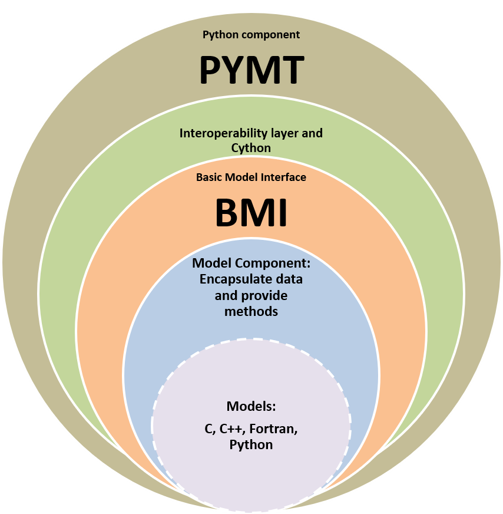
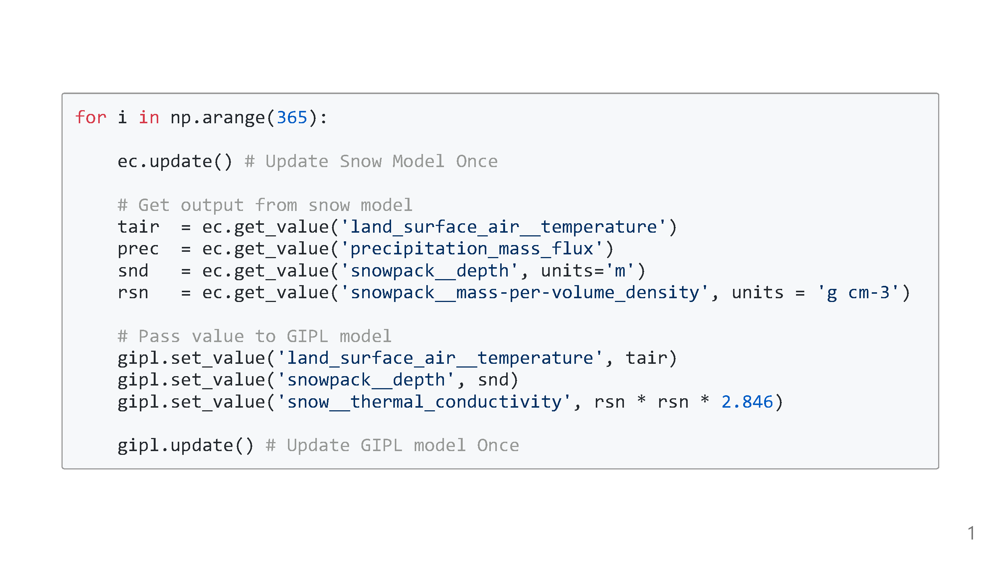
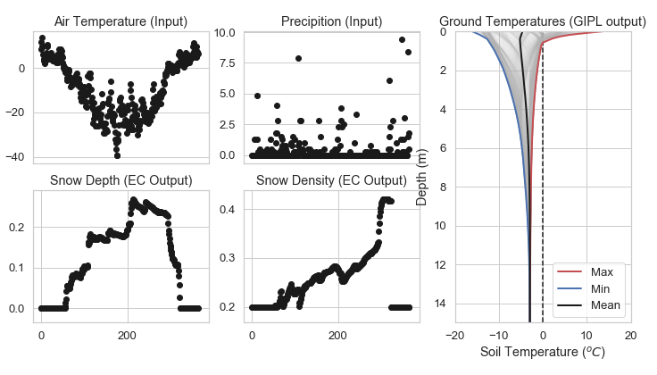
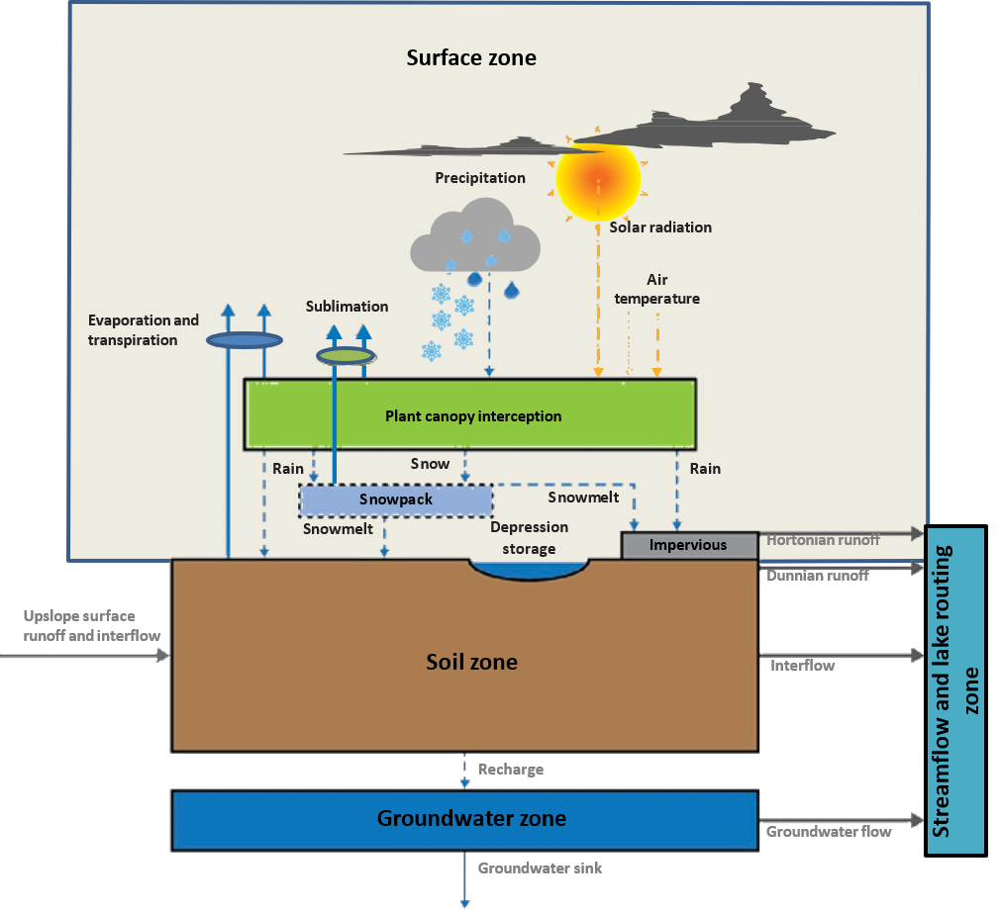
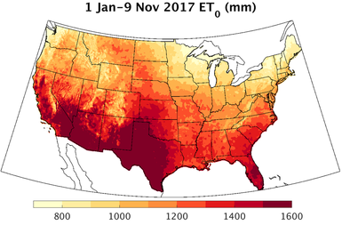

# Coupling Hydrologic Models with Data Services in an Interoperable Modeling Framework

Richard McDonald, Steve Markstrom, Parker Norton - USGS

Mark Piper and Eric Hutton - CSDMS

<!-- Thank you to the CDI community for supporting and funding this project.  I'm sure every here appreciates and understands that in addition to pursuing our understanding of process in earth sciences that computational models especially from an applied perspective are a way to spatially and temporally expand the reach of existing data and are therefore intrinsically linked to data.  

Given a good process model it's skill is intrinsically linked to data.

Most of my work at the USGS has been with flow and sediment-transport models in rivers and we always described the work as 80-90% data collection, and good data collection led to models with good skill.  

So I think in this context this project is a really good fit for CDI -->

---

# Presentation overview

1. Why are we doing this project?
2. What do we mean by a interoperable modeling framework?
   - Component models
   - CSMDS: Basic Model Interface - BMI 
   - CSDMS: Python Modeling Toolkit - pyMT
3. What do we mean by Data services?
4. Demonstration 
5. Challenges and takeaways

---

| IMPD 5-year plan | EarthMAP |
|---|---|
| Develop and deliver a Modeling and Prediction Collaborative Environment (“sandbox”) that can be used to couple hydrology and other environmental simulation models with data and analyses |  |

<!-- Integrated modeling is an important component of the US Geological Survey's Science Strategy.  Integrated modeling was identified as a priority challenge for the USGS by the National Academies of Sciences.When we first started thinking about this project one of the outcomes in WMAs IMPD was to develope a "Modeling and Prediction Collaborative Environment or "sandbox" that can be used to Couple hydrology and other environmental simulation models with data and analysis.  That is the context in which we developed this project, to use an existing and mature modeling framework to test the ideas of a modeling sandbox. 

Our Value Proposition:
An interoperable modeling framework will help scientists simulate complex earth systems by providing a consistent language agnostic software interface to construct integrated systems models with data-streams

In the meantime we've all become more aware of the EarthMAP initiative and I think from a computational modeling perspective this idea of a sandbox lies squarely in the center of the EarthMAP ven diagram.  
-->

---

<!-- ## Proof-of-concept to the following value proposition

| Proposition | EarthMAP |
|---|---|
| An interoperable modeling framework will help scientists simulate complex earth systems by providing a consistent language agnostic software interface to construct integrated systems models with data-streams |  |

<!-- Our project is a proof-of-concept of the following value proposition.  When we initiated the project we were not aware of the USGS EarthMap program.  From a computational modeling perspective, the concepts we are testing surround the EarthMap ven diagram

---
-->

<table class="tg">
<thead>
  <tr>
    <th class="tg-baqh" colspan="2">CSDMS COMPONENT MODEL HIERARCHY</th>
  </tr>
</thead>
<tbody>
  <tr>
    <td class="tg-0lax">
    <ul class="tg-0lax">
      <dl>
        <dt> Component models encapsulate a set of related functions into a reusable form.</dt>
        <dd>- In OOP, a class bundles data and provides methods that operate on the data within a single unit or component </dd>
        <dt> Components communicate with each other via interfaces</dt>
        <dt>An interface in this case is a set of common methods for example 
        </dt>
        <dd> - Initialize, run (time-step), finalize </dd>
        <dd> - setter and getter </dd>
        <dd> - time </dd>
        <dt> Data or data-streams can also be components</dt>
      </dl>
    </ul>
    </td>
    <td class="tg-0lax"></td>
  </tr>
</tbody>
</table>

<!-- The BMI formalizes earth systems components -->

---

|Example: coupled snow and permafrost temperature model| Visualization|
|:----:|:----:|
|||

<!-- Illustrates use of BMI to integrate components from different domains.  

Note: that Temperature could be it's own BMI data-stream 

Note: native language of each component is Fortran -->

---

<table class="tg">
<thead>
  <tr>
    <th class="tg-bwtg" colspan="3">CDI Project Components and Data Services</th>
  </tr>
</thead>
<tbody>
  <tr>
    <td class="tg-baqh" colspan="2">PRMS Model Components</td>
    <td class="tg-baqh">Gridmet Climate Data Services</td>
  </tr>
  <tr>
    <td class="tg-0pky">
      <ul>
        <li> Surface </li>
        <li> Soil </li>
        <li> Groundwater </li>
        <li> Streamflow </li> 
      </ul>
    </td>
    <td class="tg-0pky"></td>
    <td class="tg-0lax"></td>
  </tr>
</tbody>
</table>

---
# Quick Demonstration:
Note:
- Model run-time interaction
- Data services example
- PRMS is Fortran and we're running it in Python!
- If you're a modeler - how much fun this is!

---

# Challenges and Takeaways
- Older Fortran code would benefit from Fortran 2003 OOP and derived type enhancements 
- It takes effort to carefully wrap a model with a BMI
- High potential for similar work with other USGS models (WEBMOD, PHREEQC, MODFLOW)
   - Componentized models could be coupled (WEBMOD-PRMS, MODFLOW-PRMS)
- Other data services components are possible (WRF-Hydro outputs)

---
